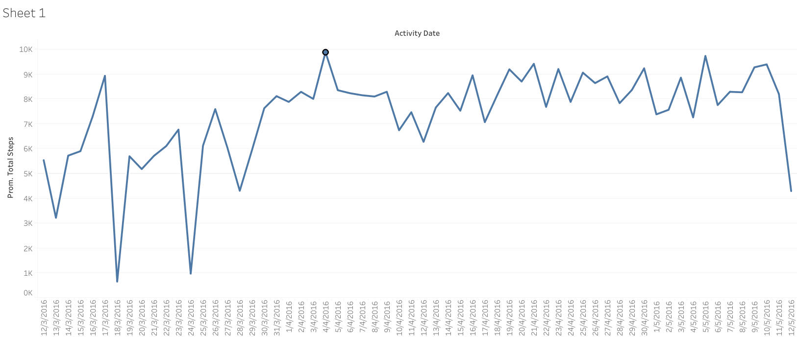

## prueba
prueba
# [prueba](https://www.youtube.com/watch?v=iL6G83HaczU)

Case Study 2: How Can a Wellness Technology Company Play It Smart?
1. What are some trends in smart device usage?
 2. How could these trends apply to Bellabeat customers?
 3. How could these trends help influence Bellabeat marketing strategy?
 You will produce a report with the following deliverables:
 1. A clear summary of the business task 
2. A description of all data sources used
3. Documentation of any cleaning or manipulation of data 
4. A summary of your analysis 
5. Supporting visualizations and key findings 
6. Your top high-level content recommendations based on your análisis

##Case Study Roadmap –  Ask
 Guiding questions 
● What is the problem you are trying to solve? 

● How can your insights drive business decisions? 

Key tasks 
1.	Identify the business task 
Tratar de ganar insight del uso de apps de salud y bienestar, mediante el análisis de datos del uso que las personas le dan a esta. Por consiguiente generar crecimiento y mayores reditos a través del buen uso de estos datos, generando una estrategia de marketing eficiente. Identificar trends
2.	Consider key stakeholders

         Urška Sršen: Bellabeat’s cofounder and Chief Creative Officer 
          Sando Mur: Mathematician and Bellabeat’s cofounder; key member of the Bellabeat executive team 
           Bellabeat marketing analytics team
 Deliverable 
A clear statement of the business task
Analizar el uso que se le dan a las apps de parte de los usuarios para poder desarrollar una estrategia de marketing eficiente

Urška Sršen, cofounder and Chief Creative Officer of Bellabeat, believes that analyzing smart device fitness data could help unlock new growth opportunities for the company. You have been asked to focus on one of Bellabeat’s products and analyze smart device data to gain insight into how consumers are using their smart devices. The insights you discover will then help guide marketing strategy for the company
She has asked the marketing analytics team to focus on a Bellabeat product and analyze smart device usage data in order to gain insight into how people are already using their smart devices. Then, using this information, she would like high-level recommendations for how these trends can inform Bellabeat marketing strategy.

Case Study Roadmap – Prepare
 Guiding questions 
● Where is your data stored?
Kaggle. 
 ● How is the data organized? Is it in long or wide format?
Long format and wide format, but mostly long.
 ● Are there issues with bias or credibility in this data? Does your data ROCCC? 

● How are you addressing licensing, privacy, security, and accessibility?

 ● How did you verify the data’s integrity?

 ● How does it help you answer your question?

 ● Are there any problems with the data?

 Key tasks 
1. Download data and store it appropriately. 
2. Identify how it’s organized. 
3. Sort and filter the data.
4. Determine the credibility of the data.
 Deliverable 
A description of all data sources used

