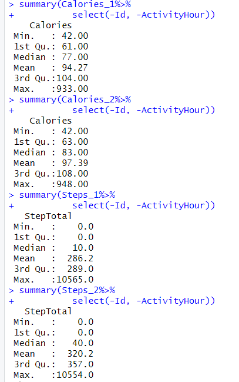

## Escenario

Bellabeat es una empresa fundada en 2013, es una compañía pequeña de tecnologia enfocada en el bienestar para mujeres que ha crecido rápidamente. 
Dentro de sus productos destacan la App Bellabeat, Leaf, Time, Spring, y membresía Bellabeat.
Su Objetivo es Convertirse en una de las compañias más grande en el mercado global de dispositivos inteligentes.
La tarea del equipo: Analizar datos de dispositivos inteligentes para obtener información sobre el uso de estos dispositivos por parte de los consumidores y guiar la estrategia de marketing.

# 1. Preguntar
Objetivo del negocio: Analizar datos de Fitbit para obtener información y guiar la estrategia de marketing para el crecimiento global de Bellabeat.

Estos datos seran presentados a los stakeholders principales Urška Sršen y Sando Mur, miembros del equipo ejecutivo y stakeholders secundarios conformados por el equipo de análisis de marketing de Bellabeat.

Se puede resumir la tarea por delante en 3 preguntas claves para desarrollar este analisis:
1.¿Cuáles son algunas tendencias en el uso de dispositivos inteligentes?
2.¿Cómo podrían aplicarse estas tendencias a los clientes de Bellabeat?
3.¿Cómo podrían estas tendencias influir en la estrategia de marketing de Bellabeat?

# 2. Preparar

Fuente de datos: Datos de 30 participantes del rastreador de fitness FitBit obtenidos desde Kaggle. https://www.kaggle.com/datasets/arashnic/fitbit

Constituido por 11 archivos para el primer mes, 18 para el segundo, abarcando un periodo total de 2 meses.

Contenido de los datos: 18 archivos CSV con datos de actividad física, frecuencia cardíaca y monitoreo del sueño minuto a minuto.

Para preparar los datos se aplicará un Enfoque ROCCC:

**R**eliable/Confiablilidad: Datos de 30 usuarios de FitBit que consintieron en la presentación de sus datos.

**O**riginal/Originalidad: Datos originales obtenidos directamente de los usuarios desde sus dispositivos inteligentes.

**C**omprehensive/Integralidad: Datos detallados y extensos pero con un tamaño de muestra pequeño e inconsistente, registrados en ciertos días de la semana. Sobre todo en el 1er mes, hay menos datos que en el 2do mes.

**C**urrent/Actuales: Datos de marzo a mayo de 2016.

**C**ited/Citación: No encontrado.


## El dataset tiene limitaciones:

* El Tamaño de la muestra son solo 30 usuarios, lo cual es pequeño para un análisis conclusivo y robusto.

* Inconsistencia en distribución de datos en numero de usuarios; 33 usuarios para actividad diaria, 24 para sueño y 8 para peso, con algunas inconsistencias en el registro de datos.

* Método de registro del peso: 5 usuarios ingresaron manualmente su peso y 3 lo registraron a través de un dispositivo wifi.

* Fechas de registro inconsistente. La Mayoría de los datos estan registrados en el 2do mes. El primer mes no se puede considerar para hacer un analisis preciso con datos tan dispersos e inconsistentes. Ademas la mayoria de los registros son de martes a jueves, lo que podría no ser suficiente para un análisis preciso.


# 3. Procesar

Para ayudarme en esta etapa de procesar voy a dividir en “hourly” y “daily” los dataset que tienen registros diarios o por hora. Dependiendo del análisis que haga con ellos . 
## DAILY
Hago analisis exploratorio inicial viendo columnas y numero de filas, filas distintas, buscando duplicados y valores nulos.
```
colnames(dailyActivity_merged)
colnames(dailyActivity_merged2)
nrow(dailyActivity_merged)
nrow(dailyActivity_merged2)
n_distinct(dailyActivity_merged)
n_distinct(dailyActivity_merged2)
sum(duplicated(dailyActivity_merged))
sum(duplicated(dailyActivity_merged2))
sum(is.na(dailyActivity_merged))
sum(is.na(dailyActivity_merged2))
```

Para el 1er mes 457. Para el 2do son 940. [QUE?] Hay que chequear, la diferencia es significativa. Son mucho menos datos en el 1er mes. No hay duplicados ni valores nulos.


Resumen general
```
summary(dailyActivity_merged %>%
          select(-Id, -ActivityDate))
summary(dailyActivity_merged2 %>%
          select(-Id, -ActivityDate))
```
Eliminare los datos "distance", son irrelevantes para el análisis que haré.

Que me dice la data?[ ……………..] Sacar conclusiones en cuanto a la diferencia de los dos meses. Minimos máximos promedios y medias.

 ## Numero de datos segun mes ##############################

Destaca la diferencia entre el 1er y 2do mes. Me interesa analizar la variable de pasos así que llevare los dos meses a tableau para una breve vista donde podre analizar la diferencia entre estos dos meses :

Suma total:

Teniendo en cuenta solo la variable step, se debería descartar el 1er mes ya que es considerable la diferencia con el 2do mes.
Aun así para estar seguro compararé la cantidad de datos totales de los 2 meses.
Primero :

Numeros Id's unicos por mes
```
n_distinct(dataActivity_sindistancia$Id)
n_distinct(dataActivity_sindistancia2$Id)
```

Los Id's registrados en los meses son 33 para el 1er mes y 35 para el 2do Por lo tanto la diferencia de datos no se debe a que menos ID’s  se hayan registrado.


 Hago merge de los dos meses y convierto la columna de fechas a tipo Date
Comprobando el tipo de dato que tiene la columna fecha con `class()` . Es “character”, hay qe convertirla.


```
dataActivity_SD_big <- merge(dataActivity_sindistancia, dataActivity_sindistancia2, all = TRUE)
dataActivity_SD_big$ActivityDate <- as.Date(dataActivity_SD_big$ActivityDate, format="%m/%d/%Y")
dataActivity_sind_week$ActivityDate <- as.Date(dataActivity_sind_week$ActivityDate, format="%m/%d/%Y")
dataActivity_sind_week2$ActivityDate <- as.Date(dataActivity_sind_week2$ActivityDate, format="%m/%d/%Y")
```

Grafica de cantidad de datos por fecha:

```
ggplot(data=dataActivity_SD_big, aes(x=ActivityDate))+
  geom_bar(fill="steelblue")+
  labs(title="Data recolectada por fecha")
```


Solo se ocupara el 2do mes por :

Descartaré el 1er mes. Para fines prácticos de este análisis solo ocupare el mes 2 ( … - ….)


------------------------------------------------------------------

promedio de total steps por dia 


----------------------------------------------------------------------

## Análisis ####

# Imagen del grafico de piza y evidenciar el uso de R con su codigo.
```
plot_ly(percentage, labels = ~level, values = ~minutes, type = 'pie',textposition = 'outside',textinfo = 'label+percent') %>%
  layout(title = 'Minutos de nivel de actividad',
         xaxis = list(showgrid = FALSE, zeroline = FALSE, showticklabels = FALSE),
         yaxis = list(showgrid = FALSE, zeroline = FALSE, showticklabels = FALSE))
```


CREACION DE COLUMNAS PARA DIAS DE LA SEMANA 
```
dataActivity_sind_week2 <- dataActivity_sindistancia2 %>% 
  mutate(Weekday = weekdays(as.Date(ActivityDate, "%m/%d/%Y")))
```
Crearé una columna adicional para los días de la semana. 
Vizualizo los dias de la semana en función de sedentarismo pasos y calorías.

QUE DIAS DE LA SEMANA HAY MAS ACTIVIDAD?
Los llevo a Tableau


###########################################
Estan medids en datos totales. Hay que hacerlo en promedios y fijarme en los outliers
Hay el mismo patron de días con mas gasto calorico y el de los días con mas minutos sedentarios. Domingo el mas bajo y empieza a subir hasta el martes el día con mas (calorías gastadas y minutos sedentarios) y luego comienza a bajar grdualmente hasta el domingo. Esto no hace sentido.
Hay que comprobar la cantidad de datos por día de la semana, probablemente los martes hay mas data registrada.
 ##########################################################
## HOURLY

Selecionaré dos dataset para analizar la cantidad de actividad y energia gastada en las diferentes horas del dia: calories y steps 
Evaluaré la actividad diaria en funcionde de pasos y calorías gastadas cada hora del día . 

## Renombrar:
 calories 1/step_1 para los dataset del 3/12/15 al 4/11/16 y  Calories_2/Steps_2 para los dataset del 4/12/16 al 5/12/16

# Resumen general



Lo mismo qe la anterior daily, 33 y 34.  Sin valores nulos.  VER DUPLICADOS. EDITAR ##########################


######### MERGE #############

######## CANTIDAD DE DATOS MES 1 Y 2 #################

```
ggplot(data=hourlyCalories_BIG, aes(x=date))+
  geom_bar(fill="steelblue")+
 labs(title="Data recolectada por fecha")

ggplot(data=hourlySteps_BIG, aes(x=date))+
  geom_bar(fill="steelblue")+
  labs(title="Data recolectada por fecha")

```
###### IMAGEN ########

data_recolectada_por_fecha_hourly.png

Si ocupare los dos meses, dado que la diferencia no es significativa.


########### OTRO PASO ##### MANIPULANDO LOS DATOS ######


######### MERGE #############
convertir los dataset separando hora y fecha.

## Creando columnas de fecha y tiempo 
```
hourlyCalories_BIG$ActivityHour <- mdy_hms(hourlyCalories_BIG$ActivityHour)
hourlyCalories_BIG$time <- as.Date(hourlyCalories_BIG$ActivityHour, format = "%H:%M:%S")
hourlyCalories_BIG$date <- as.Date(hourlyCalories_BIG$ActivityHour, format = "%d/%m/%y")

hourlySteps_BIG$ActivityHour <- mdy_hms(hourlySteps_BIG$ActivityHour)
hourlySteps_BIG$time <- as.Date(hourlySteps_BIG$ActivityHour, format = "%H:%M:%S")
hourlySteps_BIG$date <- as.Date(hourlySteps_BIG$ActivityHour, format = "%d/%m/%y")

```
#### Creacion de columna para dia de la semana
```
hourlyCalories_BIG <- hourlyCalories_BIG %>% 
  mutate(Weekday = weekdays(as.Date(date, "%d/%m/%Y")))

hourlySteps_BIG <- hourlySteps_BIG %>% 
  mutate(Weekday = weekdays(as.Date(date, "%d/%m/%Y")))
```
QUE DIAS DE LA SEMANA HAY MAS ACTIVIDAD? A QUE HORAS SE PRODUCEN MAS STEPS Y CALORIES?

# CALORIES
calorias en un marco de 24 horas :


Promedio de calorias dentro de 24 horas:


# STEPS
Promedio de pasos dados en 24 horas:


suma de pasos totales por hora:


