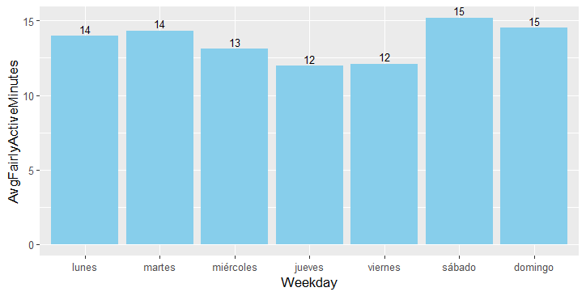
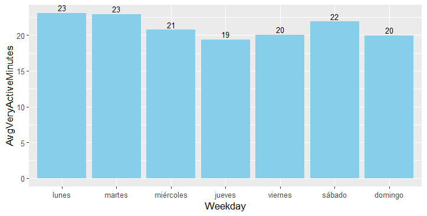
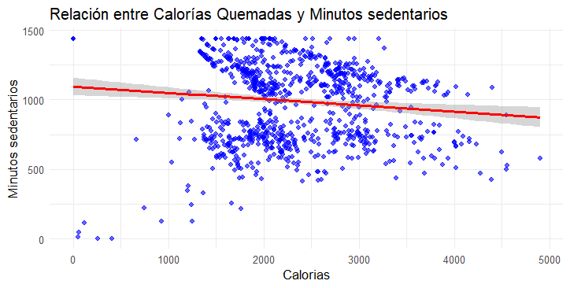
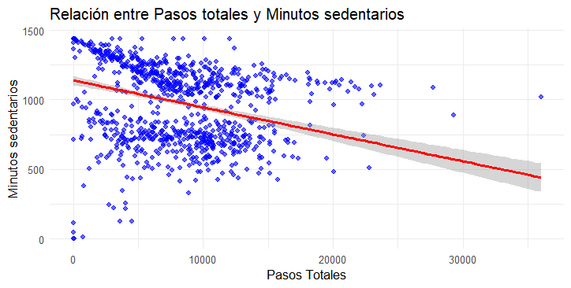
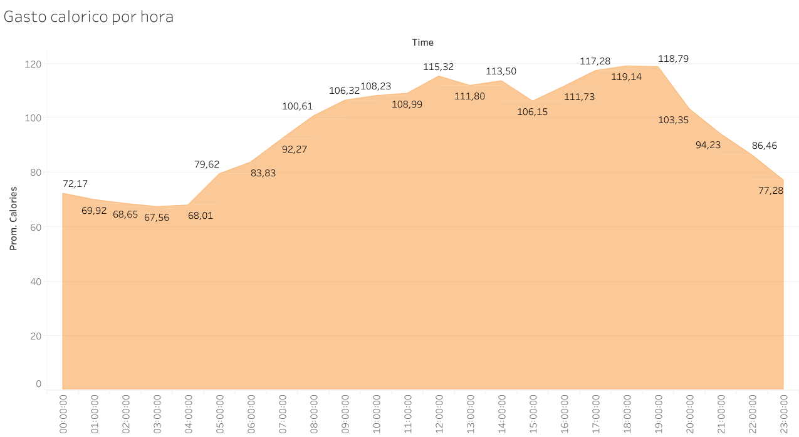
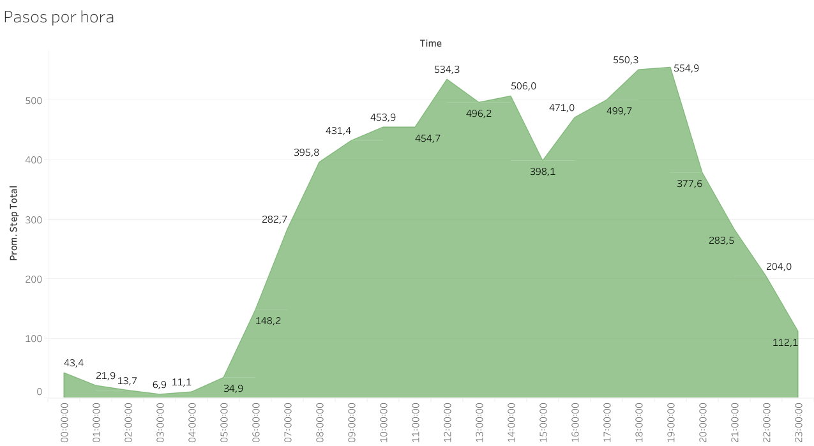

# Bellabet


## Tabla de Contenidos:

[1. Preguntar](https://github.com/silvagrino/prueba/tree/main?tab=readme-ov-file#1-preguntar)

[2. Preparar](https://github.com/silvagrino/prueba/tree/main?tab=readme-ov-file#2-preparar)

[3. Procesar](https://github.com/silvagrino/prueba/tree/main?tab=readme-ov-file#3-procesar)

[4. Analisis](https://github.com/silvagrino/prueba/tree/main?tab=readme-ov-file#3-an%C3%A1lisis)

[5. Compartir](https://github.com/silvagrino/prueba/tree/main?tab=readme-ov-file#5-compartir)

[6. Actuar](https://github.com/silvagrino/prueba/tree/main?tab=readme-ov-file#6-actuar)


Bellabeat es una empresa fundada en 2013, es una compañía pequeña de tecnología enfocada en el bienestar para mujeres que ha crecido rápidamente. 
Dentro de sus productos destacan la App Bellabeat, Leaf, Time, Spring, y membresía Bellabeat.
Su Objetivo es Convertirse en una de las compañías más grande en el mercado global de dispositivos inteligentes.
La tarea del equipo: Analizar datos de dispositivos inteligentes para obtener información sobre el uso de estos dispositivos por parte de los consumidores y guiar la estrategia de marketing.

# 1. Preguntar

Objetivo del negocio: Analizar datos de Fitbit para obtener información y guiar la estrategia de marketing para el crecimiento global de Bellabeat.

Estos datos serán presentados a los stakeholders principales Urška Sršen y Sando Mur, miembros del equipo ejecutivo y stakeholders secundarios conformados por el equipo de análisis de marketing de Bellabeat.

Se puede resumir la tarea por delante en 3 preguntas claves para desarrollar este análisis:

1. ¿Cuáles son algunas tendencias en el uso de dispositivos inteligentes?
2. ¿Cómo podrían aplicarse estas tendencias a los clientes de Bellabeat?
3. ¿Cómo podrían estas tendencias influir en la estrategia de marketing de Bellabeat?

# 2. Preparar

Fuente de datos: Datos de 30 participantes del rastreador de fitness FitBit obtenidos desde Kaggle. https://www.kaggle.com/datasets/arashnic/fitbit.

Constituido por 11 archivos para el primer mes, 18 para el segundo, abarcando un periodo total de 2 meses con datos de actividad física, frecuencia cardíaca y monitoreo del sueño minuto a minuto.


## Para preparar los datos aplicaré un Enfoque ROCCC:

* **R**eliable/Confiablilidad: Datos de 30 usuarios de FitBit que consintieron en la presentación de sus datos.

* **O**riginal/Originalidad: Datos originales obtenidos directamente de los usuarios desde sus dispositivos inteligentes.

* **C**omprehensive/Integralidad: Datos detallados y extensos pero con un tamaño de muestra pequeño e inconsistente, registrados en ciertos días de la semana. Sobre todo en el 1er mes, hay menos datos que en el 2do mes.

* **C**urrent/Actuales: Datos de marzo a mayo de 2016.

* **C**ited/Citación: No encontrado.


## El dataset tiene limitaciones:

* El Tamaño de la muestra son solo 30 usuarios, lo cual es pequeño para un análisis conclusivo y robusto.

* Inconsistencia en distribución de datos en número de usuarios; 33 usuarios para actividad diaria, 24 para sueño y 8 para peso, con algunas inconsistencias en el registro de datos.

* Método de registro del peso: 5 usuarios ingresaron manualmente su peso y 3 lo registraron a través de un dispositivo wifi.

* Fechas de registro inconsistente. La Mayoría de los datos están registrados en el 2.º mes. El primer mes no se puede considerar para hacer un analisis preciso con datos dispersos e inconsistentes.

* La mayoría de los registros son de martes a jueves, lo que podría no ser suficiente para un análisis preciso.


# 3. Procesar 

Primero seleccionaré los datasets con los que voy a trabajar, para esto tendré en cuenta la consistencia de datos, cantidad de usuarios y potenciales insgiht que podria darme para compartir con la campaña de marketing.
Comprobaré cuantos ID's diferentes hay registrados en todos los datasets. Para esto usaré `n_distinct()` dandome como resultado los id's unicos de cada dataset.

* 33 ID: dailyActivity_merged, dailyCalories_merged, dailyIntensities_merged, dailySteps_merged, hourlyCalories_merged, hourlyIntensities_merged, hourlySteps_merged, minuteCaloriesNarrow_merged, minuteCaloriesWide_merged, minuteIntensitiesNarrow_merged, minuteIntensitiesWide_merged, minuteMETsNarrow_merged, minuteStepsNarrow_merged and minuteStepsWide

* 24 ID: minuteSleep_merged and sleepDay_merged

* 14 ID: heartrate_seconds_merged

* 8 ID: weightLogInfo_merged

Debido a la poca cantidad de usuarios, descartaré los datasets de frecuencia cardiaca y peso.

Seleccionaré los datasets:
- "dailyActivity_merged" porque me entrega varios datos en un solo dataset, como lo son los minutos dependiendo de la actividad, calorias y pasos diarios 
- "hourlyCalories_merged" y "hourlySteps_merged" por qué me dan el detalle de cada hora de calorias gastadas y pasos dados.
- "sleepDay_merged" para poder analizar el patrón de sueño diario de los usuarios.


## DAILY

Hago análisis exploratorio inicial viendo columnas y número de filas, filas distintas, buscando duplicados y valores nulos.

```
colnames(dailyActivity_merged)
colnames(dailyActivity_merged2)
nrow(dailyActivity_merged)
nrow(dailyActivity_merged2)
sum(duplicated(dailyActivity_merged))
sum(duplicated(dailyActivity_merged2))
sum(is.na(dailyActivity_merged))
sum(is.na(dailyActivity_merged2))
```

Para el 1.º mes hay 457 filas. Para el 2.º mes son 940 filas. La diferencia es significativa, son mucho menos datos en el 1er mes. No hay duplicados ni valores nulos.

Eliminaré los datos de distancia, son irrelevantes para mi ruta de análisis.

## HOURLY 


Seleccionaré dos datasets para analizar la cantidad de actividad y energía gastada por horas del dia: calories y steps

```
Calories_1 <- hourlyCalories_merged_3_12_16_4_11_16
Calories_2 <- hourlyCalories_merged_4_12_16_5_12_16
Steps_1 <- hourlySteps_merged_3_12_16_4_11_16
Steps_2 <- hourlySteps_merged_4_12_16_5_12_16
```

Aplico un análisis exploratorio

```
 `colnames`
 `nrow`
 `sum(duplicated(_)`
 `sum(is.na(_)`
 `n_distinct`
 `class`
```

Sin valores duplicados ni valores nulos. En la cantidad de ID hay de 33 a 34. En la cantidad de filas hay una diferencia de 1.985 entre los datos del 1er y el 2do mes que voy a analizar si es significativa al graficar la cantidad de datos totales por mes.


No eliminaré valores 0. No hay horas donde se gaste 0 calorías, siempre hay un gasto calorico basal. Las horas en donde hay 0 pasos son parte del analisis, saber cuando no hubo movimiento.


## Sleep 

Cargo `sleepday_merged` y aplico las mismas funciones al dataset de horas de sueño.
Encuentro 3 duplicados, los cuales remuevo.

Creo una columna con la diferencia de tiempo en cama y tiempo dormido para obtener el tiempo que se han tardado los usuarios dormir.

```
sleepDay_merged <- sleepDay_merged %>%
  mutate(TimeToFallAsleep = TotalTimeInBed - TotalMinutesAsleep)
```


## Numero de datos segun mes 

Como acabo de comprobar hay una diferencia significativa en dailyActivity_merged entre el 1er y 2do mes. Para el 1er mes hay 457 filas. Para el 2do mes son 940 filas.
Evaluaré la diferencia en la cantidad de datos en los 2 datasets: 1.º mes(3/12/16 al 4/11/16) y 2do mes (4/12/16 al 5/12/16).
Mediré los datos según mes de todos los datasets para saber con cuáles trabajaré.

### DAILY (dailyActivity_merged, dailyActivity_merged2)

Hago merge de los meses en un único archivo.

```
dataActivity_SD_big <- merge(dataActivity_sindistancia, dataActivity_sindistancia2, all = TRUE)
```

Numeros Id's unicos por mes
```
n_distinct(dataActivity_sindistancia$Id)
n_distinct(dataActivity_sindistancia2$Id)
```

Los Id's registrados en los meses son 33 para el 1.º mes y 35 para el 2.º. Por lo tanto, la diferencia de datos no se debe a que menos ID’s se hayan registrado.

Graficaré los datos totales por fecha, por lo cual lo primero será comprobar el tipo de dato que tiene la columna fecha con `class()` .
Es “character” por lo tanto, hay que convertirla.
Hago merge de los dos meses y convierto la columna de fechas a tipo Date.

```
dataActivity_SD_big$ActivityDate <- as.Date(dataActivity_SD_big$ActivityDate, format="%m/%d/%Y")
dataActivity_sind_week$ActivityDate <- as.Date(dataActivity_sind_week$ActivityDate, format="%m/%d/%Y")
dataActivity_sind_week2$ActivityDate <- as.Date(dataActivity_sind_week2$ActivityDate, format="%m/%d/%Y")
```

### Plot cantidad de datos por fecha:

```
ggplot(data=dataActivity_SD_big, aes(x=ActivityDate))+
  geom_bar(fill="steelblue")+
  labs(title="Data recolectada por fecha")
```


Solo ocuparé el 2.º mes, la diferencia de datos totales es grande. El 2.º mes tiene datos más consistentes. Ocupar el 1er mes me llevaria a un analisis impreciso y a tener conclusiones erradas.

## HOURLY 

Hago un merge de los datasets de calories y steps respectivamente

```
hourlySteps_BIG <- merge(Steps_1, Steps_2, all = TRUE)
hourlyCalories_BIG <- merge(Calories_1, Calories_2, all = TRUE)
```

### CANTIDAD DE DATOS MES 1 Y 2 

```
ggplot(data=hourlyCalories_BIG, aes(x=date))+
  geom_bar(fill="steelblue")+
 labs(title="Data recolectada por fecha")

ggplot(data=hourlySteps_BIG, aes(x=date))+
  geom_bar(fill="steelblue")+
  labs(title="Data recolectada por fecha")
```


Si ocupare los dos meses en este caso, dado que la diferencia no es significativa.

### Sleep


También ocuparé los dos meses de las horas de sueño, hay regularidad en los datos.

## Creación de columna para día de la semana

Crearé una columna adicional para los días de la semana en todos el conjunto de datos; "dataActivity", "hourlyCalories", "hourlySteps", "sleepDay"

### DAILY

```
dataActivity_sind_week2 <- dataActivity_sindistancia2 %>% 
  mutate(Weekday = weekdays(as.Date(ActivityDate, "%m/%d/%Y")))
```


## Cantidad de registros por día de la semana

```
registros_por_dia_sleep <- sleepDay_merged_week %>%
  group_by(Weekday) %>%
  summarise(TotalRegistros = n())
```


                Daily                                             Sleep

    


```
ggplot(data=registros_por_dia, aes(x=reorder(Weekday, -TotalRegistros), y=TotalRegistros)) +
  geom_bar(stat="identity", fill="steelblue") +
  labs(title="Cantidad de Datos Totales por Día de la Semana",
       x="Día de la Semana",
       y="Cantidad de Registros") +
  theme_minimal()
```


Hay más datos registrados los martes, miércoles y jueves. Graficaré con promedios.

## Creación de columnas de fecha y tiempo 

Para poder preparar las visualizaciones donde pueda analizar cada hora del día primero tengo que dividir la columna de fecha y tiempo de los dataset "hourly"

### Hourly

Prepararé los datasets de horas separando fechas y horas en columnas diferentes.

```
hourlyCalories_BIG$ActivityHour <- mdy_hms(hourlyCalories_BIG$ActivityHour)
hourlyCalories_BIG$time <- as.Date(hourlyCalories_BIG$ActivityHour, format = "%H:%M:%S")
hourlyCalories_BIG$date <- as.Date(hourlyCalories_BIG$ActivityHour, format = "%d/%m/%y")

hourlySteps_BIG$ActivityHour <- mdy_hms(hourlySteps_BIG$ActivityHour)
hourlySteps_BIG$time <- as.Date(hourlySteps_BIG$ActivityHour, format = "%H:%M:%S")
hourlySteps_BIG$date <- as.Date(hourlySteps_BIG$ActivityHour, format = "%d/%m/%y")

```


# 4. Análisis 

### Daily

```
summary(dailyActivity_merged2 %>%
          select(-Id, -ActivityDate))
```


El conjunto de datos dailyActivity_merged2 proporciona una visión detallada de los patrones de actividad física de los usuarios durante el período registrado. En general, los usuarios lograron una media diaria de aproximadamente 7,638 pasos, con una distancia promedio de 5.49 kilómetros. Estos datos indican un nivel bajo-moderado de actividad física diaria, con variabilidad entre los días en que los usuarios estaban más activos y aquellos en los que estuvieron menos activos.

Además, los minutos de actividad intensa y moderada reflejan que, aunque la mayoría de los días los usuarios no participaron en actividades de alta intensidad, hubo momentos en los que sí lo hicieron, alcanzando hasta 210 minutos de actividad intensa en un solo día. Los minutos sedentarios promedio fueron altos, con una media cercana a los 991 minutos por día, lo que sugiere que los usuarios pasaron una parte significativa de su día sin moverse. Pero también hay que considerar que los minutos sedentarios también son tiempo de sueño, lo que representa 419 minutos en promedio por día (6,9 horas) como se expone en el análisis de horas de sueño.

El gasto calórico medio fue de 2,304 calorías por día, lo que está en línea con un nivel moderado de actividad física. 


### Hourly 
 


Hay una diferencia de 1985 registros entre el 1.er y 2.º mes. Steps_2 destaca con un promedio y una mediana más elevada respecto a Step_1. Diferencia que también se hace visible al observar el 3.er cuartil. Por lo tanto, los usuarios del 2.º mes deberían registrar más tiempo destinado a actividad más vigorosa.


### Sleep

```
summary(sleepDay_merged      %>%
          select(-Id, -SleepDay, -TotalSleepRecords))
```


La mayoría de las personas duermen entre 6 y 8 horas (observando el 1.er y 3.º cuartil: 361 - 490 minutos).
Gracias a la columna de `TimeToFallAsleep` podemos saber el tiempo que los usuarios están en cama sin dormir. Esto puede considerar el tiempo que se demora el usuario en quedarse dormido, así como también tiempos de insomnio o el tiempo que el usuario tarda en levantarse de la cama en la mañana. Aunque la mayoría de las personas parecen conciliar el sueño en menos de 30 minutos (observando los cuartiles), hay casos donde podrían presentarse problemas de conciliación del sueño o despertares nocturnos. También hay casos extremos que podrían reflejar insomnio o problemas para dormir. 

En la mayoría de las columnas, los valores promedio (mean) están cerca de la mediana, indicando que los datos probablemente están distribuidos de manera relativamente uniforme, excepto en el tiempo para conciliar el sueño.

Este análisis superficial sugiere que la mayoría de las personas tienen buenos hábitos de sueño, pero hay algunos casos extremos que podrían requerir más investigación.


## Gráfico de pizza de minutos de actividad.
### Daily

Graficaré el total de minutos de actividad de las 4 categorías: very active, fairly active, lightly active y sedentary

```
plot_ly(percentage, labels = ~level, values = ~minutes, type = 'pie',textposition = 'outside',textinfo = 'label+percent') %>%
  layout(title = 'Minutos de nivel de actividad',
         xaxis = list(showgrid = FALSE, zeroline = FALSE, showticklabels = FALSE),
         yaxis = list(showgrid = FALSE, zeroline = FALSE, showticklabels = FALSE))
```


Los minutos sedentarios son la gran mayoría con un 81,3%. Hay que considerar que estos datos se miden a través de las 24 horas del día, incluyendo las horas de sueño. Se infiere que la actividad en los días laborales se asocia a trabajos de baja demanda física,
por lo tanto, habrá que medir la actividad fuera del horario laboral típico.

La Organización Mundial de la Salud (OMS) recomienda que los adultos realicen al menos 150 a 300 minutos de actividad física aeróbica de intensidad moderada a la semana. También se puede realizar un mínimo de 75 a 150 minutos de actividad física aeróbica de intensidad vigorosa, o una combinación de ambas. Lo cual equivale a 21,4 a 42,8 minutos diarios de intensidad moderada o de 10,7 a 21,4 minutos de intensidad vigorosa. 


## Minutos de actividad por días de la semana

### Actividad moderada y Actividad vigorosa

  


En promedio, los usuarios no alcanzan la recomendación diaria de minutos de actividad moderada (21,3 a 42,8 minutos). El día con más actividad dentro de este rango es el sábado, los días laborales de la semana se mantienen estables.


Todos los usuarios en promedio alcanzan la recomendación, incluso superando el máximo sugerido. Los días con mayor actividad se producen en lunes y martes, días laborales. Habrá que ver en que horario se producen estos minutos más activos, sabiendo así si se produce esta actividad en horarios típicamente laborales o fuera de la jornada. Analizaré más adelante la actividad por horas.

#### Compruebo cuantos de los usuarios cumplen con las recomendaciones de actividad de la OMS.

```
active_users <- daily_activity %>%
  filter(FairlyActiveMinutes >= 21.4 | VeryActiveMinutes>=10.7) %>% 
  group_by(Id) %>% 
  count(Id) 
```

En el dataset hay 30 usuarios que cumplen con el criterio de al menos tener 150 minutos de actividad física aeróbica de intensidad moderada y un mínimo de 75 minutos de actividad física aeróbica de intensidad vigorosa, o una combinación de ambas semanalmente.


## Minutos sedentarios por día de la semana.

Lunes destaca como el día con más minutos sedentarios y jueves como el día con menos. ¿Pero esto se relacionará con tener más actividad física? ¿Una relación inversamente proporcional?


A continuación analizaré los pasos por día, para comprobar si los días con mayor o menor actividad están asociados a la actividad física(pasos) o a otros factores de estrés que podrían aumentar el gasto calórico(mayores pulsaciones y/o mayor gasto calórico)


## Promedio de pasos por día de la semana 

```
ggplot(avg_steps_per_day, aes(x = Weekday, y = AvgSteps)) +
  geom_bar(stat = "identity", fill = "skyblue") +
  geom_text(aes(label = round(AvgSteps, 0)), vjust = -0.3, size = 3)
  labs(title = "Promedio de pasos por día de la semana",
       x = "Día de la semana",
       y = "Pasos promedio") +
  theme_minimal() +
  theme(axis.text.x = element_text(angle = 45, hjust = 1))
```


Podemos observar que el día con más pasos es el sábado, esto puede deberse a que los usuarios hagan más actividades recreativas en este día a diferencia de los días laborales donde les puede resultar más complicado. Durante lunes a viernes la cantidad de pasos se mantiene constante, destacando el día martes como el 2.º día con más pasos de la semana. Destaca el día sábado con una diferencia significativa respecto a los otros días de la semana.

El día domingo destaca como el día con menos pasos, probablemente porque es un día que los usuarios descansan y se preparan para una nueva semana laboral.


## Calorías por día de la semana

Jueves el día con menos calorías gastadas. Martes y sábado como los días con más calorías.
Lunes como el segundo día con más calorías. ¿A qué se puede deber esto? Pareciera que no hay una relación directa con días laborales y fines de semana.


## Relación entre Calorías Quemadas y Minutos sedentarios



Existe una tendencia negativa débil entre calorías quemadas y minutos sedentarios. Es decir, a medida que las calorías quemadas aumentan, los minutos sedentarios tienden a disminuir.
La mayoría de los puntos se concentran en un rango de 1000 a 2500 calorías quemadas y entre 500 a 1200 minutos sedentarios.
Aunque hay cierta dispersión, se observa que en valores altos de calorías quemadas (>3000), los minutos sedentarios son generalmente más bajos.

Personas que queman más calorías parecen pasar menos tiempo sedentarias, lo cual es coherente con un estilo de vida más activo.
Sin embargo, la relación no es muy fuerte, ya que hay puntos con alta variabilidad (por ejemplo, algunas personas queman pocas calorías, pero aún tienen pocos minutos sedentarios, y viceversa).

Esto podría deberse a que las calorías quemadas pueden incluir actividades sedentarias con bajo impacto, como ciertas formas de ejercicio ligero.
Las calorías quemadas, aunque útiles, parecen incluir más factores (por ejemplo, metabolismo basal o actividades estáticas como yoga), lo que diluye su relación con el sedentarismo.


## Relación entre Pasos totales y Minutos sedentarios



Existe una relación negativa clara entre pasos totales y minutos sedentarios. Es decir, a medida que los pasos totales aumentan, los minutos sedentarios tienden a disminuir de forma más consistente. La línea de regresión muestra esta tendencia negativa.
El intervalo de confianza, sugiere que la relación observada es relativamente confiable en todo el rango.
Para valores altos de pasos totales (>20,000), los minutos sedentarios son generalmente bajos (<500), lo que indica que las personas más activas tienden a pasar menos tiempo en actividades sedentarias.
Hay algunas observaciones dispersas, como puntos con muchos pasos totales, pero minutos sedentarios moderados o puntos con pocos pasos y también pocos minutos sedentarios.
Este gráfico refuerza la idea de que un mayor nivel de actividad física (medido en pasos totales) está asociado con una reducción significativa en el tiempo sedentario.
La relación negativa es más fuerte que en el gráfico de calorías quemadas vs. minutos sedentarios, lo que sugiere que los pasos totales podrían ser un mejor indicador de actividad física que las calorías quemadas.

##### Comparaciones entre los dos gráficos#################################################

1. Relación entre calorías quemadas, pasos totales y minutos sedentarios:

En el gráfico de calorías quemadas vs. minutos sedentarios, la relación es débil, lo que sugiere que las calorías quemadas no siempre están directamente ligadas a una reducción significativa del tiempo sedentario.

En el gráfico de pasos totales vs. minutos sedentarios, la relación negativa es más pronunciada, indicando que caminar más (mayor cantidad de pasos) está mucho más relacionado con una reducción del tiempo sedentario.

3. Observaciones clave:
Pasos totales como mejor predictor de tiempo activo.
 Aumentar los pasos totales parece tener un impacto más directo en la reducción de los minutos sedentarios que simplemente quemar calorías. Esto podría deberse a que las calorías quemadas pueden incluir actividades sedentarias con bajo impacto, como ciertas formas de ejercicio ligero.
Distribución de los datos:
En el gráfico de pasos, los datos están más concentrados en torno a valores bajos de pasos y altos minutos sedentarios, pero muestran un patrón claro de disminución.
En el gráfico de calorías, aunque hay una tendencia negativa, los puntos están más dispersos, reflejando una mayor variabilidad en la relación entre estos indicadores.

Pasos totales son una métrica más específica y directa para evaluar el impacto de la actividad física en el tiempo sedentario. Las calorías quemadas, aunque útiles, parecen incluir más factores (por ejemplo, metabolismo basal o actividades estáticas como yoga), lo que diluye su relación con el sedentarismo.


## entre las calorías y pasos totales hay una diferencia. Las calorías se pueden medir, pero los usuarios generan más variabilidad, los pasos son una medida más consistente que se relaciona inversamente proporcional a los minutos sedentarios. Las calorías pueden variar más por un factor demográfico, etc. (edit) pero los pasos totales son una medida que se relaciona más estrechamente con reducir el sedentarismo. Aun así, las dos son medidas que se tienen que tener en cuenta para poder medir la actividad diaria. 

La combinación de estos dos gráficos destaca que los pasos totales son un mejor indicador para predecir el tiempo sedentario. Sin embargo, incorporar las calorías quemadas podría complementar el análisis, especialmente si se consideran actividades físicas que no necesariamente involucran caminar. Los análisis sugeridos ayudarán a identificar patrones más profundos y útiles para promover la actividad física y reducir el sedentarismo. 


######  1. Relación entre calorías quemadas y pasos totales: ###################################


### SLEEP

## Tiempo de sueño por dia de la semana

```
ggplot(avg_sleep_per_day, aes(x = Weekday, y = AvgMinutesAsleep)) +
  geom_bar(stat = "identity", fill = "lightblue") +
  geom_text(aes(label = round(AvgMinutesAsleep, 0)), vjust = -0.3, size = 3) + 
  labs(title = "Promedio de minutos de sueño por día de la semana",
       x = "Día de la semana",
       y = "Minutos promedio de sueño") +
  theme_minimal() +
  theme(axis.text.x = element_text(angle = 45, hjust = 1))
```


La diferencia entre los días laborales y fines de semana se ve muy marcada. Domingo tiene el día con más horas de sueño como cabria esperar de un día de descanso, seguido del sábado. Dentro de los días laborales, que se mantienen muy constantes, destaca el día miércoles, justo en mitad de la semana, donde quizás los usuarios necesitan dormir un poco más para seguir con la semana de manera más productiva. 
Si bien hay diferencias entre los días, el promedio se mantiene constante, por lo que se podría decir que hay una buena higiene de sueño entre los usuarios. 


## Gráfico de dispersión entre calorías y pasos totales

```
ggplot(dataActivity_sind_week2, aes(x = TotalSteps, y = Calories)) +
  geom_point(color = "blue", alpha = 0.6) +  # Puntos en el gráfico
  geom_smooth(method = "lm", col = "red") +  # Línea de regresión
  labs(title = "Relación entre Pasos Totales y Calorías Quemadas",
       x = "Total de Pasos",
       y = "Calorías") +
  theme_minimal()
```


Como cabria esperar hay una correlación positiva entre los pasos totales y las calorías gastadas. Mientras más pasos se dan a lo largo del día, aumenta el gasto calórico de los usuarios.

Hay que destacar la presencia de outliers. Por un lado, están quienes probablemente tienen un gasto energético poco común por tener un metabolismo basal más elevado, gastar más energía en reposo. Estos usuarios pueden tener pocos pasos totales marcados pero tener un gasto calórico elevado. Así mismo hay otros outliers a los cuales les pasa lo contrario. Dan muchos pasos, pero no tienen un gasto calórico muy elevado. Aun así, no hay que perder la perspectiva de que estos son casos aislados. 


A continuación analizaré las variables dentro de 24 horas. 


# HOURLY ¿A QUÉ HORAS SE PRODUCEN MÁS STEPS Y CALORIES?

## CALORIES

Promedio de calorías dentro de 24 horas:


Como es de esperar, en los horarios de sueño hay muy poco gasto energético. Desde las 5 de la mañana al mediodía hay un aumento gradual y constante, para mantenerse dentro de las próximas horas del día sin mayor fluctuación. De 17:00 a 19:00 horas destacan como las horas con mayor gasto energético, probablemente por qué marca el fin de la jornada laboral y los usuarios se enfocan en otras actividades que traen consigo una mayor activación física. 

## STEPS
Promedio de pasos dados en 24 horas:


Los pasos comienzan a ser más elevados cuando los usuarios despiertan hasta las 8:00, destacando esta hora como un pico en la mañana, probablemente por qué hay más movimiento para llegar al trabajo, luego baja gradualmente hasta las 12:00 donde vuelve a haber una ventana que se extiende hasta las 14:00 donde los pasos se elevan, marcando la hora de almuerzo. En la tarde se va aumentando gradualmente hasta alcanzar un máximo de pasos del día a las 19:00, que se asume debe ser el horario de más actividad. EDIT ################


###
 FINAL

En resumen, dailyActivity_merged2 indica que los usuarios tienen un patrón de actividad que incluye tanto momentos de alta actividad como periodos de inactividad, ofreciendo oportunidades para promover una mayor actividad física y reducir el sedentarismo. EDIT : Esto va más en conclusiones, esto es análisis.

## sleep

-  Info de esto, respaldo para sacar alguna conclusión. Recomendación de tiempo de pantalla y recordatorio de la app para prepararse para irse a dormir. DONE


# 5. Compartir

# 6. Actuar
