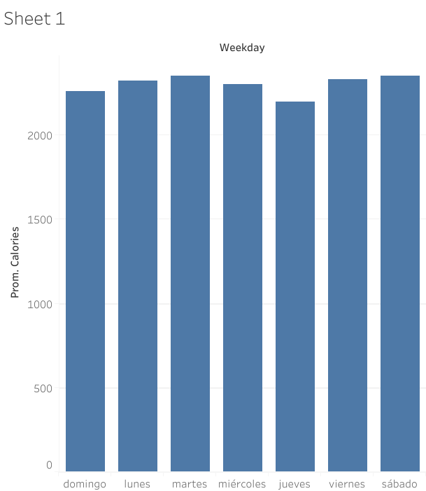

## Escenario

Bellabeat es una empresa fundada en 2013, es una compañía pequeña de tecnologia enfocada en el bienestar para mujeres que ha crecido rápidamente. 
Dentro de sus productos destacan la App Bellabeat, Leaf, Time, Spring, y membresía Bellabeat.
Su Objetivo es Convertirse en una de las compañias más grande en el mercado global de dispositivos inteligentes.
La tarea del equipo: Analizar datos de dispositivos inteligentes para obtener información sobre el uso de estos dispositivos por parte de los consumidores y guiar la estrategia de marketing.

# 1. Preguntar
Objetivo del negocio: Analizar datos de Fitbit para obtener información y guiar la estrategia de marketing para el crecimiento global de Bellabeat.

Estos datos seran presentados a los stakeholders principales Urška Sršen y Sando Mur, miembros del equipo ejecutivo y stakeholders secundarios conformados por el equipo de análisis de marketing de Bellabeat.

Se puede resumir la tarea por delante en 3 preguntas claves para desarrollar este analisis:
1.¿Cuáles son algunas tendencias en el uso de dispositivos inteligentes?
2.¿Cómo podrían aplicarse estas tendencias a los clientes de Bellabeat?
3.¿Cómo podrían estas tendencias influir en la estrategia de marketing de Bellabeat?

# 2. Preparar

Fuente de datos: Datos de 30 participantes del rastreador de fitness FitBit obtenidos desde Kaggle. https://www.kaggle.com/datasets/arashnic/fitbit.

Constituido por 11 archivos para el primer mes, 18 para el segundo, abarcando un periodo total de 2 meses con datos de actividad física, frecuencia cardíaca y monitoreo del sueño minuto a minuto.

Ocupo `n_distinct()` para comprobar los id's unicos de cada dataset buscando consistencia en los dataset.

 33 ID: dailyActivity_merged, dailyCalories_merged, dailyIntensities_merged, dailySteps_merged, hourlyCalories_merged, hourlyIntensities_merged, hourlySteps_merged, minuteCaloriesNarrow_merged, minuteCaloriesWide_merged, minuteIntensitiesNarrow_merged, minuteIntensitiesWide_merged, minuteMETsNarrow_merged, minuteStepsNarrow_merged and minuteStepsWide

24 ID: minuteSleep_merged and sleepDay_merged

14 ID: heartrate_seconds_merged

8 ID: weightLogInfo_merged

Debido a la poca cantidad de usuarios descartaré los dataset de frecuencia cardiaca y peso.

## Para preparar los datos aplicaré un Enfoque ROCCC:

* **R**eliable/Confiablilidad: Datos de 30 usuarios de FitBit que consintieron en la presentación de sus datos.

* **O**riginal/Originalidad: Datos originales obtenidos directamente de los usuarios desde sus dispositivos inteligentes.

* **C**omprehensive/Integralidad: Datos detallados y extensos pero con un tamaño de muestra pequeño e inconsistente, registrados en ciertos días de la semana. Sobre todo en el 1er mes, hay menos datos que en el 2do mes.

* **C**urrent/Actuales: Datos de marzo a mayo de 2016.

* **C**ited/Citación: No encontrado.


## El dataset tiene limitaciones:

* El Tamaño de la muestra son solo 30 usuarios, lo cual es pequeño para un análisis conclusivo y robusto.

* Inconsistencia en distribución de datos en numero de usuarios; 33 usuarios para actividad diaria, 24 para sueño y 8 para peso, con algunas inconsistencias en el registro de datos.

* Método de registro del peso: 5 usuarios ingresaron manualmente su peso y 3 lo registraron a través de un dispositivo wifi.

* Fechas de registro inconsistente. La Mayoría de los datos estan registrados en el 2do mes. El primer mes no se puede considerar para hacer un analisis preciso con datos dispersos e inconsistentes.

* La mayoria de los registros son de martes a jueves, lo que podría no ser suficiente para un análisis preciso.


# 3. Procesar

## DAILY
Hago analisis exploratorio inicial viendo columnas y numero de filas, filas distintas, buscando duplicados y valores nulos.
```
colnames(dailyActivity_merged)
colnames(dailyActivity_merged2)
nrow(dailyActivity_merged)
nrow(dailyActivity_merged2)
sum(duplicated(dailyActivity_merged))
sum(duplicated(dailyActivity_merged2))
sum(is.na(dailyActivity_merged))
sum(is.na(dailyActivity_merged2))
```

Para el 1er mes hay 457 filas. Para el 2do mes son 940 filas. La diferencia es significativa, son mucho menos datos en el 1er mes. No hay duplicados ni valores nulos.

Eliminare los datos de distancia, son irrelevantes para mi ruta de análisis.

## HOURLY (calories 1/step_1, Calories_2/Steps_2)

Selecionaré dos dataset para analizar la cantidad de actividad y energia gastada en las diferentes horas del dia: calories y steps
Evaluaré la actividad diaria en función de pasos y calorías gastadas cada hora del día. 

## Renombrar:

```
Calories_1 <- hourlyCalories_merged_3_12_16_4_11_16
Calories_2 <- hourlyCalories_merged_4_12_16_5_12_16
Steps_1 <- hourlySteps_merged_3_12_16_4_11_16
Steps_2 <- hourlySteps_merged_4_12_16_5_12_16
```

 ####### PONER CODIGO DE R ############

# Resumen


Lo mismo qe el dataset anterior daily, 34 id's distintos (calories1/steps1) y 33 (calories2/steps2). Sin valores nulos ni duplicados.

No eliminare valores 0. No hay horas donde se gaste 0 calorias, siempre se esta gastando algo y las horas donde hay 0 pasos sirven para el analisis, saber cuando no hubo movimiento.

# Numero de datos segun mes 

Evaluaré si hay alguna diferencia en la cantidad de datos en los 2 datasets del primer (3/12/16 al 4/11/16) y segundo mes (4/12/16 al 5/12/16).

## DAILY (dailyActivity_merged, dailyActivity_merged2)

dataActivity_SD_big <- merge(dataActivity_sindistancia, dataActivity_sindistancia2, all = TRUE)

Al llevar los datos a Tableau de los pasos totales destaca la diferencia entre el 1er y 2do mes. 
Suma de pasos totales por dia: 


promedio de pasos totales por dia:


En este caso solo he considerado la variable de pasos totales por lo que se debería descartar el 1er mes al haber una gran diferencia en la cantidad de registros en comparación al 2do mes.
Aun así ahora voy a comparar la cantidad de datos totales registrados de los 2 meses.

Numeros Id's unicos por mes
```
n_distinct(dataActivity_sindistancia$Id)
n_distinct(dataActivity_sindistancia2$Id)
```

Los Id's registrados en los meses son 33 para el 1er mes y 35 para el 2do. Por lo tanto la diferencia de datos no se debe a que menos ID’s se hayan registrado.

Graficaré los datos totales por fecha por lo cual lo primero que hare será comprobar el tipo de dato que tiene la columna fecha con `class()` . Es “character” por lo tanto hay qe convertirla.
Hago merge de los dos meses y convierto la columna de fechas a tipo Date.

```
dataActivity_SD_big$ActivityDate <- as.Date(dataActivity_SD_big$ActivityDate, format="%m/%d/%Y")
dataActivity_sind_week$ActivityDate <- as.Date(dataActivity_sind_week$ActivityDate, format="%m/%d/%Y")
dataActivity_sind_week2$ActivityDate <- as.Date(dataActivity_sind_week2$ActivityDate, format="%m/%d/%Y")
```

Grafico de cantidad de datos por fecha:

```
ggplot(data=dataActivity_SD_big, aes(x=ActivityDate))+
  geom_bar(fill="steelblue")+
  labs(title="Data recolectada por fecha")
```


Solo ocupare el 2do mes, la diferencia de datos totales es grande. El 2do mes tiene datos mas consistentes. Ocupar el 1er mes me llevaria a un analisis impreciso y a tener conclusiones erradas.

## HOURLY 

Hago un merge de los dataset de calories y steps respectivamente

## CANTIDAD DE DATOS MES 1 Y 2 

```
ggplot(data=hourlyCalories_BIG, aes(x=date))+
  geom_bar(fill="steelblue")+
 labs(title="Data recolectada por fecha")

ggplot(data=hourlySteps_BIG, aes(x=date))+
  geom_bar(fill="steelblue")+
  labs(title="Data recolectada por fecha")
```

###### IMAGEN ########


Si ocupare los dos meses, dado que la diferencia no es significativa.

########### OTRO PASO ##### MANIPULANDO LOS DATOS ######

#################################################################

## SLEEP 

##### CANTIDAD DE DATOS POR MES ##########


## DIAS DE LA SEMANA  

## DAILY

Crearé una columna adicional para los días de la semana.

############ HACERLO PARA TODOS LOS DATASET : DAILY STEPS CALORIES SLEEP

```
dataActivity_sind_week2 <- dataActivity_sindistancia2 %>% 
  mutate(Weekday = weekdays(as.Date(ActivityDate, "%m/%d/%Y")))
```
###### MOVER DESDE AQUI A ANALISIS ESTO ES SOLO PROCESAR #######

```
ggplot(data=registros_por_dia, aes(x=reorder(Weekday, -TotalRegistros), y=TotalRegistros)) +
  geom_bar(stat="identity", fill="steelblue") +
  labs(title="Cantidad de Datos Totales por Día de la Semana",
       x="Día de la Semana",
       y="Cantidad de Registros") +
  theme_minimal()
```


##########################

Este sedentarismo hay que sacarlo. Son la cantidad total de minutos, Tengo que llegar al promedio por usuario de tiempo sedentario por dia 


Diferencia entre suma de datos y promedios, ahora la diferencia entre minutos sedentarios y steps y calories no es tanta. Las diferencias son mayores en la de la sumas porque hay mas datos algunos dias que otros, los dias martes con la mayor cantidad. 


 promedio total steps

 promedio calories

 Promedio sedentary

MALA MANERA DE GRAFICAR. PROBAR ALGO MAS. AL LLEVAR A PROMEDIOS LAS DIFERENCIAS NO SON TANTAS COMO EN SUMA. 
###########################################

Estan medids en datos totales. Hay que hacerlo en promedios y fijarme en los outliers
Hay el mismo patron de días con mas gasto calorico y el de los días con mas minutos sedentarios. Domingo el mas bajo y empieza a subir hasta el martes el día con mas (calorías gastadas y minutos sedentarios) y luego comienza a bajar grdualmente hasta el domingo. Esto no hace sentido.
Hay que comprobar la cantidad de datos por día de la semana, probablemente los martes hay mas data registrada.

La

LOS MARTES HAY MAS DATOS REGISTRADOS POR ESO TENGO QUE REEVALUAR ESTA SECCION, PARA HACERLA CON PROMEDIOS. PRIMERO DEMOSTRAR LA DIFERENCIA DE DATA ENTRE DIAS DE LA SEMANA.

si bien el cambio es sustancial, no se puede concluir que tenga unra relacion directa. Se lleva a concluir que los dias con mas steps y gasto calorico, tambien hay mas minutos sedentarios en conpensacion de la atividad que se esta ahaciendo. En cambio en los dias que hay menos actividad, se tiende a mantener una actividad mas estable sin tanta fluctuacion tan drastica entre los minutos sedentarios y la actividad diaria mas vigorosa. Estas diferencias tambien se deben a que hay mas datos registrados los martes.
EDIT. LO QUE ESTOY MIDIENDO.

#### Tengo que poner los sedentary minutes en promedio o en suma? en el dataset son la cantidad de minutos por dia en sedentario. Grafico los otros "minutes"?

#########################################################################################################################################


######### MERGE #############
convertir los dataset separando hora y fecha.

## Creando columnas de fecha y tiempo 
```
hourlyCalories_BIG$ActivityHour <- mdy_hms(hourlyCalories_BIG$ActivityHour)
hourlyCalories_BIG$time <- as.Date(hourlyCalories_BIG$ActivityHour, format = "%H:%M:%S")
hourlyCalories_BIG$date <- as.Date(hourlyCalories_BIG$ActivityHour, format = "%d/%m/%y")

hourlySteps_BIG$ActivityHour <- mdy_hms(hourlySteps_BIG$ActivityHour)
hourlySteps_BIG$time <- as.Date(hourlySteps_BIG$ActivityHour, format = "%H:%M:%S")
hourlySteps_BIG$date <- as.Date(hourlySteps_BIG$ActivityHour, format = "%d/%m/%y")

```
#### Creacion de columna para dia de la semana


# HOURLY
```
hourlyCalories_BIG <- hourlyCalories_BIG %>% 
  mutate(Weekday = weekdays(as.Date(date, "%d/%m/%Y")))

hourlySteps_BIG <- hourlySteps_BIG %>% 
  mutate(Weekday = weekdays(as.Date(date, "%d/%m/%Y")))
```
QUE DIAS DE LA SEMANA HAY MAS ACTIVIDAD? A QUE HORAS SE PRODUCEN MAS STEPS Y CALORIES?


Vizualizo los dias de la semana en función de sedentarismo pasos y calorías.

QUE DIAS DE LA SEMANA HAY MAS ACTIVIDAD registrada?

############################################################################################################################################


------------------------------------------------------------------

----------------------------------------------------------------------

## Análisis ####

Resumen general

```
summary(dailyActivity_merged2 %>%
          select(-Id, -ActivityDate))
```


El conjunto de datos dailyActivity_merged2 proporciona una visión detallada de los patrones de actividad física de los usuarios durante el período registrado. En general, los usuarios lograron una media diaria de aproximadamente 7,638 pasos, con una distancia promedio de 5.49 kilómetros. Estos datos indican un nivel moderado de actividad física diaria, con variabilidad entre los días en que los usuarios estaban más activos y aquellos en los que estuvieron menos activos.

Además, los minutos de actividad intensa y moderada reflejan que, aunque la mayoría de los días los usuarios no participaron en actividades de alta intensidad, hubo momentos en los que sí lo hicieron, alcanzando hasta 210 minutos de actividad intensa en un solo día. Los minutos sedentarios promedio fueron altos, con una media cercana a los 991 minutos por día, lo que sugiere que los usuarios pasaron una parte significativa de su día sin moverse.

#### DIAS Y HORAS EN DONDE HUBO MAS ACTIVIDAD ######

El gasto calórico medio fue de 2,304 calorías por día, lo que está en línea con un nivel moderado de actividad física. En resumen, dailyActivity_merged2 indica que los usuarios tienen un patrón de actividad que incluye tanto momentos de alta actividad como periodos de inactividad, ofreciendo oportunidades para promover una mayor actividad física y reducir el sedentarismo. EDIT : Esto va mas en conclusiones, esto es analisis.


# Imagen del grafico de piza y evidenciar el uso de R con su codigo.

Graficaré el total de minutos de actividad de las 4 categorias: very active, fairly active, lightly active y sedentary


```
plot_ly(percentage, labels = ~level, values = ~minutes, type = 'pie',textposition = 'outside',textinfo = 'label+percent') %>%
  layout(title = 'Minutos de nivel de actividad',
         xaxis = list(showgrid = FALSE, zeroline = FALSE, showticklabels = FALSE),
         yaxis = list(showgrid = FALSE, zeroline = FALSE, showticklabels = FALSE))
```


Los minutos sedentarios son la gran mayoria con un 81,3%. Hay que considerar que estos datos se miden a traves de las 24 horas del dia, incluyendo las horas de sueño. Se infiere que la actividad en los dias laborales se asocia a trabajos de baja demanda fisica, por lo tanto habra que medir la actividad fuera del horario laboral tipico. EDIT Hay que considerar los datos de actividad mas activa, y exponerlos a la informacion de las recomendaciones de actividad fisica. Desde ya se ve que esta al debe  EDIT.


 ##########################################################


# HOURLY 

# CALORIES
calorias en un marco de 24 horas :


Promedio de calorias dentro de 24 horas:


# STEPS
Promedio de pasos dados en 24 horas:


suma de pasos totales por hora:


