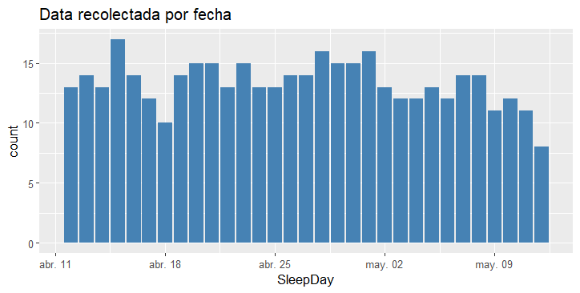

## Escenario

Bellabeat es una empresa fundada en 2013, es una compañía pequeña de tecnologia enfocada en el bienestar para mujeres que ha crecido rápidamente. 
Dentro de sus productos destacan la App Bellabeat, Leaf, Time, Spring, y membresía Bellabeat.
Su Objetivo es Convertirse en una de las compañias más grande en el mercado global de dispositivos inteligentes.
La tarea del equipo: Analizar datos de dispositivos inteligentes para obtener información sobre el uso de estos dispositivos por parte de los consumidores y guiar la estrategia de marketing.

# 1. Preguntar

Objetivo del negocio: Analizar datos de Fitbit para obtener información y guiar la estrategia de marketing para el crecimiento global de Bellabeat.

Estos datos seran presentados a los stakeholders principales Urška Sršen y Sando Mur, miembros del equipo ejecutivo y stakeholders secundarios conformados por el equipo de análisis de marketing de Bellabeat.

Se puede resumir la tarea por delante en 3 preguntas claves para desarrollar este analisis:
1.¿Cuáles son algunas tendencias en el uso de dispositivos inteligentes?
2.¿Cómo podrían aplicarse estas tendencias a los clientes de Bellabeat?
3.¿Cómo podrían estas tendencias influir en la estrategia de marketing de Bellabeat?

# 2. Preparar

Fuente de datos: Datos de 30 participantes del rastreador de fitness FitBit obtenidos desde Kaggle. https://www.kaggle.com/datasets/arashnic/fitbit.

Constituido por 11 archivos para el primer mes, 18 para el segundo, abarcando un periodo total de 2 meses con datos de actividad física, frecuencia cardíaca y monitoreo del sueño minuto a minuto.


## Para preparar los datos aplicaré un Enfoque ROCCC:

* **R**eliable/Confiablilidad: Datos de 30 usuarios de FitBit que consintieron en la presentación de sus datos.

* **O**riginal/Originalidad: Datos originales obtenidos directamente de los usuarios desde sus dispositivos inteligentes.

* **C**omprehensive/Integralidad: Datos detallados y extensos pero con un tamaño de muestra pequeño e inconsistente, registrados en ciertos días de la semana. Sobre todo en el 1er mes, hay menos datos que en el 2do mes.

* **C**urrent/Actuales: Datos de marzo a mayo de 2016.

* **C**ited/Citación: No encontrado.


## El dataset tiene limitaciones:

* El Tamaño de la muestra son solo 30 usuarios, lo cual es pequeño para un análisis conclusivo y robusto.

* Inconsistencia en distribución de datos en numero de usuarios; 33 usuarios para actividad diaria, 24 para sueño y 8 para peso, con algunas inconsistencias en el registro de datos.

* Método de registro del peso: 5 usuarios ingresaron manualmente su peso y 3 lo registraron a través de un dispositivo wifi.

* Fechas de registro inconsistente. La Mayoría de los datos estan registrados en el 2do mes. El primer mes no se puede considerar para hacer un analisis preciso con datos dispersos e inconsistentes.

* La mayoria de los registros son de martes a jueves, lo que podría no ser suficiente para un análisis preciso.


# 3. Procesar 

Primero seleccionaré los dataset con los que voy a trabajar, para esto tendre en cuenta la consistencia de datos, cantidad de usuarios y teniendo en cuenta que podria darme mayores insgiht para compartir con la campaña de marketing, datos usables (EDIT)
Comprobaré cuantos ID's diferentes hay registrados en todos los dataset
Para esto voy a usar `n_distinct()` para comprobar los id's unicos de cada dataset.

33 ID: dailyActivity_merged, dailyCalories_merged, dailyIntensities_merged, dailySteps_merged, hourlyCalories_merged, hourlyIntensities_merged, hourlySteps_merged, minuteCaloriesNarrow_merged, minuteCaloriesWide_merged, minuteIntensitiesNarrow_merged, minuteIntensitiesWide_merged, minuteMETsNarrow_merged, minuteStepsNarrow_merged and minuteStepsWide

24 ID: minuteSleep_merged and sleepDay_merged

14 ID: heartrate_seconds_merged

8 ID: weightLogInfo_merged

Debido a la poca cantidad de usuarios descartaré los dataset de frecuencia cardiaca y peso.

Seleccionaré los dataset 
"dailyActivity_merged" porque me entrega varios datos en un solo dataset, como lo son los minutos dependiendo de la actividad, calorias y pasos diarios 
hourlyCalories_merged y hourlySteps_merged por que me dan el detalle de cada hora de calorias gastadas y pasos dados.
"sleepDay_merged" para poder analizar el patron de sueño diario de los usuarios.


## DAILY

Hago analisis exploratorio inicial viendo columnas y numero de filas, filas distintas, buscando duplicados y valores nulos.

```
colnames(dailyActivity_merged)
colnames(dailyActivity_merged2)
nrow(dailyActivity_merged)
nrow(dailyActivity_merged2)
sum(duplicated(dailyActivity_merged))
sum(duplicated(dailyActivity_merged2))
sum(is.na(dailyActivity_merged))
sum(is.na(dailyActivity_merged2))
```

Para el 1er mes hay 457 filas. Para el 2do mes son 940 filas. La diferencia es significativa, son mucho menos datos en el 1er mes. No hay duplicados ni valores nulos.

Eliminare los datos de distancia, son irrelevantes para mi ruta de análisis.

## HOURLY 

#### exploratorio para hourly y sleepDay_merged


Selecionaré dos dataset para analizar la cantidad de actividad y energia gastada por horas del dia: calories y steps

```
Calories_1 <- hourlyCalories_merged_3_12_16_4_11_16
Calories_2 <- hourlyCalories_merged_4_12_16_5_12_16
Steps_1 <- hourlySteps_merged_3_12_16_4_11_16
Steps_2 <- hourlySteps_merged_4_12_16_5_12_16
```

Aplico una analisis exploratorio

```
 `colnames`
 `nrow`
 `sum(duplicated(_)`
 `sum(is.na(_)`
 `n_distinct`
 `class`
```

Sin valores duplicados ni valores nulos. En la cantidad de ID hay de 33 a 34. En la cantidad de filas hay una diferencia de 1.985 entre los datos del 1er y el 2do mes que voy a analizar si es significativa al graficar la cantidad de datos totales por mes.


No eliminare valores 0. No hay horas donde se gaste 0 calorias, siempre se esta gastando algo y las horas en donde hay 0 pasos sirven para el analisis, saber cuando no hubo movimiento.


## Sleep 

Aplico las mismas funciones al dataset de horas de sueño.
Se encuentran 3 duplicados , los cuales se remueven.


## Numero de datos segun mes 

Como acabo de comprobar hay una diferencia significativa en dailyActivity_merged entre el 1er y 2do mes. Para el 1er mes hay 457 filas. Para el 2do mes son 940 filas.
Evaluaré la diferencia en la cantidad de datos en los 2 datasets: 1er mes(3/12/16 al 4/11/16) y 2do mes (4/12/16 al 5/12/16).
Medire los datos segun mes de todos los dataset para saber con cuales trabajaré.

### DAILY (dailyActivity_merged, dailyActivity_merged2)

Hago merge de los meses en un unico archivo.

```
dataActivity_SD_big <- merge(dataActivity_sindistancia, dataActivity_sindistancia2, all = TRUE)
```

Numeros Id's unicos por mes
```
n_distinct(dataActivity_sindistancia$Id)
n_distinct(dataActivity_sindistancia2$Id)
```

Los Id's registrados en los meses son 33 para el 1er mes y 35 para el 2do. Por lo tanto la diferencia de datos no se debe a que menos ID’s se hayan registrado.

Graficaré los datos totales por fecha por lo cual lo primero será comprobar el tipo de dato que tiene la columna fecha con `class()` .
Es “character” por lo tanto hay qe convertirla.
Hago merge de los dos meses y convierto la columna de fechas a tipo Date.

```
dataActivity_SD_big$ActivityDate <- as.Date(dataActivity_SD_big$ActivityDate, format="%m/%d/%Y")
dataActivity_sind_week$ActivityDate <- as.Date(dataActivity_sind_week$ActivityDate, format="%m/%d/%Y")
dataActivity_sind_week2$ActivityDate <- as.Date(dataActivity_sind_week2$ActivityDate, format="%m/%d/%Y")
```

### Plot cantidad de datos por fecha:

```
ggplot(data=dataActivity_SD_big, aes(x=ActivityDate))+
  geom_bar(fill="steelblue")+
  labs(title="Data recolectada por fecha")
```


Solo ocupare el 2do mes, la diferencia de datos totales es grande. El 2do mes tiene datos mas consistentes. Ocupar el 1er mes me llevaria a un analisis impreciso y a tener conclusiones erradas.

## HOURLY 

Hago un merge de los dataset de calories y steps respectivamente

```
hourlySteps_BIG <- merge(Steps_1, Steps_2, all = TRUE)
hourlyCalories_BIG <- merge(Calories_1, Calories_2, all = TRUE)
```

### CANTIDAD DE DATOS MES 1 Y 2 

```
ggplot(data=hourlyCalories_BIG, aes(x=date))+
  geom_bar(fill="steelblue")+
 labs(title="Data recolectada por fecha")

ggplot(data=hourlySteps_BIG, aes(x=date))+
  geom_bar(fill="steelblue")+
  labs(title="Data recolectada por fecha")
```


Si ocupare los dos meses en este caso, dado que la diferencia no es significativa.

### Sleep





## Creacion de columna para dia de la semana

Crearé una columna adicional para los días de la semana en todos el conjunto de datos.

### DAILY

```
dataActivity_sind_week2 <- dataActivity_sindistancia2 %>% 
  mutate(Weekday = weekdays(as.Date(ActivityDate, "%m/%d/%Y")))
```

### HOURLY

```
hourlyCalories_BIG <- hourlyCalories_BIG %>% 
  mutate(Weekday = weekdays(as.Date(date, "%d/%m/%Y")))

hourlySteps_BIG <- hourlySteps_BIG %>% 
  mutate(Weekday = weekdays(as.Date(date, "%d/%m/%Y")))
```

### SLEEP

```
sleepDay_merged_week <- sleepDay_merged %>% 
  mutate(Weekday = weekdays(as.Date(SleepDay, "%m/%d/%Y")))
```

Voy a comprobar cuantos registros hay para los dias de la semana ya que al llevar las tablas a tableau ya noto incongruencias

Si bien trabajaré los datos en promedios, ya en las sumas de datos destaca una tendencia en los dias martes, miercoles y jueves en diferentes variables. 

  

¿Como es posible que martes y miercoles sean los dias con mas pasos y calorias gastadas y al mismo tiempo sean los dias con mas minutos sedentarios?
Voy a comprobar los datos totales por dia de la semana para saber si esta fluctuacion se debe a una mayor cantidad de registros en esos dias especificos.

```
registros_por_dia_sleep <- sleepDay_merged_week %>%
  group_by(Weekday) %>%
  summarise(TotalRegistros = n())
```

## Visualizar la cantidad de registros por día de la semana


                Daily                                             Sleep

    


```
ggplot(data=registros_por_dia, aes(x=reorder(Weekday, -TotalRegistros), y=TotalRegistros)) +
  geom_bar(stat="identity", fill="steelblue") +
  labs(title="Cantidad de Datos Totales por Día de la Semana",
       x="Día de la Semana",
       y="Cantidad de Registros") +
  theme_minimal()
```


Hay mas datos registrados los martes, miercoles y jueves, por esto se debe la diferencia en las tablas anteriores. Graficaré con promedios.

## Creación de columnas de fecha y tiempo 

Para poder preparar las vizualizaciones donde pueda analizar cada hora del dia primero tengo que dividir la columna de fecha y tiempo de los dataset "hourly"

### Hourly

Prepararé los dataset de horas separando fechas y horas en columnas diferentes.

```
hourlyCalories_BIG$ActivityHour <- mdy_hms(hourlyCalories_BIG$ActivityHour)
hourlyCalories_BIG$time <- as.Date(hourlyCalories_BIG$ActivityHour, format = "%H:%M:%S")
hourlyCalories_BIG$date <- as.Date(hourlyCalories_BIG$ActivityHour, format = "%d/%m/%y")

hourlySteps_BIG$ActivityHour <- mdy_hms(hourlySteps_BIG$ActivityHour)
hourlySteps_BIG$time <- as.Date(hourlySteps_BIG$ActivityHour, format = "%H:%M:%S")
hourlySteps_BIG$date <- as.Date(hourlySteps_BIG$ActivityHour, format = "%d/%m/%y")

```


# 3. Análisis 


```
summary(dailyActivity_merged2 %>%
          select(-Id, -ActivityDate))
```


El conjunto de datos dailyActivity_merged2 proporciona una visión detallada de los patrones de actividad física de los usuarios durante el período registrado. En general, los usuarios lograron una media diaria de aproximadamente 7,638 pasos, con una distancia promedio de 5.49 kilómetros. Estos datos indican un nivel bajo-moderado de actividad física diaria, con variabilidad entre los días en que los usuarios estaban más activos y aquellos en los que estuvieron menos activos.

Además, los minutos de actividad intensa y moderada reflejan que, aunque la mayoría de los días los usuarios no participaron en actividades de alta intensidad, hubo momentos en los que sí lo hicieron, alcanzando hasta 210 minutos de actividad intensa en un solo día. Los minutos sedentarios promedio fueron altos, con una media cercana a los 991 minutos por día, lo que sugiere que los usuarios pasaron una parte significativa de su día sin moverse.

El gasto calórico medio fue de 2,304 calorías por día, lo que está en línea con un nivel moderado de actividad física. 


### hourly 
 
## Resumen


Se mantienen estables los datos en los 2 meses. Una media de pasos un poco mas elevada el 2do mes.


######  CHAT GPT ######################

Hay una diferencia de 1985 registros entre el 1er y 2do mes. Steps_2 destaca con un promedio y una mediana mas elevada respecto a Step_1. Diferencia que también se hace visible al observar el 3er cuartil. Por lo tanto los usuarios del 2do mes deberian registrar mas tiempo destinado a actividad mas vigorosa.


#### Sleep

```
summary(sleepDay_merged      %>%
          select(-Id, -SleepDay, -TotalSleepRecords))
```


La mayoría de las personas duermen entre 6 y 8 horas (observando el 1er y 3er cuartil: 361 - 490 minutos).
Gracias a la columna de `TimeToFallAsleep` podemos saber el tiempo que los usuarios estan en cama sin dormir. Esto puede considerar el tiempo que se demora el usuario en quedarse dormido asi como tambien tiempos de insomnio o el tiempo que el usuario demora en levantarse de la cama en la mañana. Aunque la mayoría de las personas parecen conciliar el sueño en menos de 30 minutos (observando los cuartiles), hay casos donde podrian presentarse problemas de conciliación del sueño o despertares nocturnos. También hay casos extremos que podrían reflejar insomnio o problemas para dormir. 

En la mayoría de las columnas, los valores promedio (mean) están cerca de la mediana, indicando que los datos probablemente están distribuidos de manera relativamente uniforme, excepto en el tiempo para conciliar el sueño.

Este análisis superficial sugiere que la mayoría de las personas tienen buenos hábitos de sueño, pero hay algunos casos extremos que podrían requerir más investigación.

## Promedio de pasos por dia de la semana #####################################################################################################

##  Daily

```
ggplot(avg_steps_per_day, aes(x = Weekday, y = AvgSteps)) +
  geom_bar(stat = "identity", fill = "skyblue") +
  geom_text(aes(label = round(AvgSteps, 0)), vjust = -0.3, size = 3)
  labs(title = "Promedio de pasos por día de la semana",
       x = "Día de la semana",
       y = "Pasos promedio") +
  theme_minimal() +
  theme(axis.text.x = element_text(angle = 45, hjust = 1))
```


Podemos observar que el dia con mas pasos es el sabado, esto puede deberse a que los usuarios hagan mas actividades recreativas en este dia a diferencia de los dias laborales donde les puede resultar mas complicado. Durante lunes a viernes la cantidad de pasos se mantiene constante, destacando el dia martes como el 2do dia con mas pasos de la semana. Que como ya he comprobado es el dia con mas registros. Pero aun siendo martes,miercoles y jueves los dias con mas cantidad de registros por parte de los usuarios, destaca el dia sabado, por lo tanto es un dato a tener en cuenta.

El dia domingo destaca como el dia con menos pasos probablemente porque es un dia que los usuarios ocupan para descansar y prepararse para una nueva semana laboral.


Calorias por dia de la semana
Jueves el dia con menos calorias gastadas. Martes y sabado como los dias con mas calorias .
Lunes como el segundo dia con mas calorias. A que se puede deber esto? Pareciera que no hay una relacion directa con dias laborales y fines de semana.


Minutos sedentarios por dia de la semana.
Lunes y martes y domingo los dias con mas minutos sedentarios. Jueves el dia con menos, seguido del sabado . Same .


########################## EVALUAR #################################################################################


## SLEEP


# Crear el gráfico de barras del tiempo promedio de sueño por día de la semana

```
ggplot(avg_sleep_per_day, aes(x = Weekday, y = AvgMinutesAsleep)) +
  geom_bar(stat = "identity", fill = "lightblue") +
  geom_text(aes(label = round(AvgMinutesAsleep, 0)), vjust = -0.3, size = 3) + 
  labs(title = "Promedio de minutos de sueño por día de la semana",
       x = "Día de la semana",
       y = "Minutos promedio de sueño") +
  theme_minimal() +
  theme(axis.text.x = element_text(angle = 45, hjust = 1))
```


La diferencia entre los dias se da de manera muy marcada entre los dias laborales y los fines de semana. Domingo tiene el dia con mas horas de sueño como cabria esperar seguida del sabado. Dentro de la semana que se mantiene constante destaca el dia miercoles, osea justo la mitad de la semana donde quizas los usuarios tienden a dormir un poco mas para seguir con la semana de manera mas productiva EDIT #########

############################## summary con las nuevas columnas de sleepDay_merged ######################################


###### TIEMPO EN QUEDARSE DORMIDO ######## PARA QUE ? ##############


####### cargo sleepday_merged y creo una columna con la diferencia de tiempo en cama y tiempo dormido para tener el tiempo que se han demorado los usuarios en quedarse dormidos.

```
sleepDay_merged <- sleepDay_merged %>%
  mutate(TimeToFallAsleep = TotalTimeInBed - TotalMinutesAsleep)
```

-	 Info de esto, respaldo para sacar alguna conclusión. Recomendación de tiempo de pantalla y recordatorio de la app para prepararse para irse a dormir. DONE


##  Grafica de correlacion pasos totales y calorias 


# Crear el gráfico de dispersión entre calorías y pasos totales

```
ggplot(dataActivity_sind_week2, aes(x = TotalSteps, y = Calories)) +
  geom_point(color = "blue", alpha = 0.6) +  # Puntos en el gráfico
  geom_smooth(method = "lm", col = "red") +  # Línea de regresión
  labs(title = "Relación entre Pasos Totales y Calorías Quemadas",
       x = "Total de Pasos",
       y = "Calorías") +
  theme_minimal()
```


Como cabria esperar hay una correlación positiva entre los pasos totales y las calorias gastadas. Mientras mas pasos se dan aumenta el gasto calorico de los usuarios.
Aun asi hay que destacar la presencia de outliers. Por un lado estan quienes probablemente tienen un gasto energetico poco comun por tener un metabolismo basal mas elevado, gastar mas energia en reposo. Estos usuarios pueden tener pocos pasos totales marcados pero tener un gasto calorico elevado. Asi mismo hay otros outliers a los cuales les pasa lo contrario. Dan muchos pasos pero no tienen un gasto calorico muy elevado.
EDIT########


# Imagen del grafico de piza y evidenciar el uso de R con su codigo.

Graficaré el total de minutos de actividad de las 4 categorias: very active, fairly active, lightly active y sedentary

```
plot_ly(percentage, labels = ~level, values = ~minutes, type = 'pie',textposition = 'outside',textinfo = 'label+percent') %>%
  layout(title = 'Minutos de nivel de actividad',
         xaxis = list(showgrid = FALSE, zeroline = FALSE, showticklabels = FALSE),
         yaxis = list(showgrid = FALSE, zeroline = FALSE, showticklabels = FALSE))
```


Los minutos sedentarios son la gran mayoria con un 81,3%. Hay que considerar que estos datos se miden a traves de las 24 horas del dia, incluyendo las horas de sueño. Se infiere que la actividad en los dias laborales se asocia a trabajos de baja demanda fisica, por lo tanto habra que medir la actividad fuera del horario laboral tipico. EDIT Hay que considerar los datos de actividad mas activa, y exponerlos a la informacion de las recomendaciones de actividad fisica. Desde ya se ve que esta al debe  EDIT.


A continuación analizare las variables dentro de 24 horas. 


# HOURLY 
A QUE HORAS SE PRODUCEN MAS STEPS Y CALORIES?

# CALORIES

Promedio de calorias dentro de 24 horas:


# STEPS
Promedio de pasos dados en 24 horas:


###
 FINAL

En resumen, dailyActivity_merged2 indica que los usuarios tienen un patrón de actividad que incluye tanto momentos de alta actividad como periodos de inactividad, ofreciendo oportunidades para promover una mayor actividad física y reducir el sedentarismo. EDIT : Esto va mas en conclusiones, esto es analisis.

