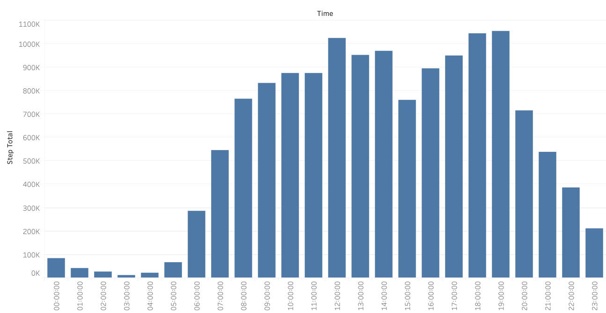

## Escenario

Empresa: Bellabeat, fundada en 2013, es una compañía pequeña de alta tecnologia enfocada en el bienestar para mujeres que ha crecido rápidamente. 

Productos: Aplicación Bellabeat, Leaf, Time, Spring, y membresía Bellabeat.

Objetivo: Convertirse en una de las compañias más grande en el mercado global de dispositivos inteligentes.

Tarea del equipo: Analizar datos de dispositivos inteligentes para obtener información sobre el uso de estos dispositivos por parte de los consumidores y guiar la estrategia de marketing.

# 1. Tarea
Objetivo del negocio: Analizar datos de Fitbit para obtener información y guiar la estrategia de marketing para el crecimiento global de Bellabeat.

Interesados principales: Urška Sršen y Sando Mur, miembros del equipo ejecutivo.

Interesados secundarios: Equipo de análisis de marketing de Bellabeat.

# 2. Preparar
Fuente de datos: Datos de 30 participantes del rastreador de fitness FitBit obtenidos de Kaggle. Constituido por n°11 archivos para el primer mes, 18 para el segundo, abarcando un periodo de 2 meses.

Contenido de los datos: 18 archivos CSV con datos de actividad física, frecuencia cardíaca y monitoreo del sueño minuto a minuto.

## Enfoque ROCCC:

**R**eliable/Confiablilidad: Datos de 30 usuarios de FitBit que consintieron en la presentación de sus datos.

**O**riginal/Originalidad: Datos originales obtenidos directamente de los usuarios.

**C**omprehensive/Integralidad: Datos detallados, pero con un tamaño de muestra pequeño e inconsistente, registrados en ciertos días de la semana. Especialmente en el 1er mes, hay menos datos que en el 2do mes.

**C**urrent/Actuales: Datos de marzo a mayo de 2016, no reflejan necesariamente los hábitos actuales de los usuarios.

**C**ited/Citación: Desconocida.

## Limitaciones del conjunto de datos:

* El Tamaño de la muestra son solo 30 usuarios, lo cual es pequeño para un análisis conclusivo y robusto.

* Inconsistencia en distribución de datos en numero de usuarios; 33 usuarios para actividad diaria, 24 para sueño y 8 para peso, con algunas inconsistencias en el registro de datos.

* Método de registro del peso: 5 usuarios ingresaron manualmente su peso y 3 lo registraron a través de un dispositivo wifi.

* Fechas de registro inconsistente. La Mayoría de los datos estan registrados en el 2do mes, el primer mes no se puede considerar para hacer un analisis preciso con datos tan dispersos e inconsistentes. Ademas la mayoria de los registros son de martes a jueves, lo que podría no ser suficiente para un análisis preciso.

# 3. Process 

## DAILY
  solo data activity

Puedo tambien calcular los minutos activos para ponerlos aqui, hacer una suma de columnas

LLEVAR A TABLEAU

porque no voy a ocupar el 1er dataset del primer mes, evidenciando que hay pocos datos :

Promedio :

Suma total:

promedio de total steps por dia 

Solo se ocupara el 2do mes por :

# Imagen del grafico de piza y evidenciar el uso de R con su codigo.

# Imagenes de Tableau de otros 

## HOURLY

dos dataset : calories y steps para analizar la cantidad de actividad y energia gastada en las diferentes horas del dia

convertir los dataset separando hora y fecha.

## EDITAR

calorias en un marco de 24 horas :

Promedio de calorias dentro de 24 horas:

Promedio de pasos dados en 24 horas:

Total de pasos dados en 24 horas:

suma total de calorias por hora:

suma de pasos totales por hora:

## EDITAR 

